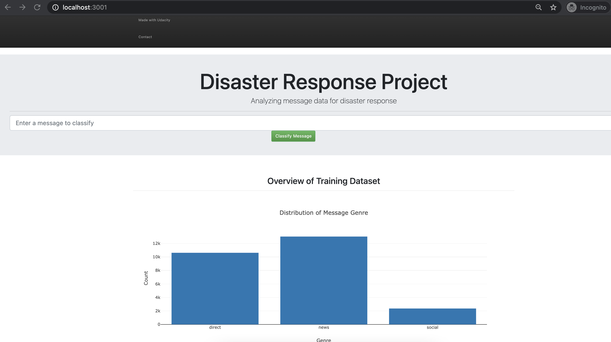
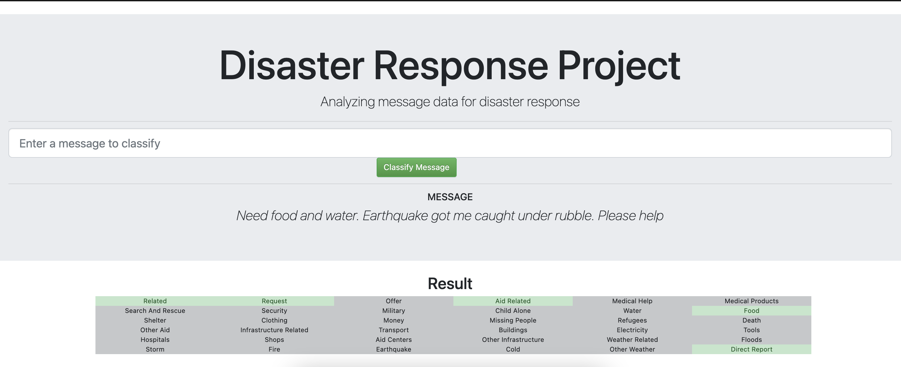

# Disaster Reponse Pipeline

## Summary
In the modern day of social media there is a lot of communication going on during and right after disasters strike.
This information stream comes mostly from people in need in the affected areas and are a rich source of information for rescue workers.
Unfortunately the volume of these messages is high, at the same time the rescue worker doesn't have time to spare.

It would be of great help to the rescue party if they would get a filtered list of messages that are important to them.
This is where this pipeline can help. In this pipeline the raw messages are taken as input for a multi label classification model
to allow workers to filter incoming messages effectively, reduce the amount of time spent scanning through communication and
increase the time they can spend to rescue victims.

The pipeline takes in a set of prelabeled messages, trains a classification model and exposes the result in a easy to use
web application. The webapplication provides some basic statistics and doubles as an interface to input message and get
a classification result.


The web application home page looks like this:


On the homepage a new message can be entered and the message with receive 1 or more labels out of 36 possible values. 
Getting labels for a new message:


## How to run the pipeline
The pipeline contains three separate steps that need to be run in order.
1. `python data/process_data.py data/disaster_messages.csv data/disaster_categories.csv data/clean_messages.db`
2. `python models/train_classifier.py data/clean_messages.db models/message_model.pkl`
3. `python app/run.py`

### Setting up the environment 
The pipeline requires a python version >3.6. The required python packages can be installed with `pip install -r requirements.txt`

### Step 1. Preparing the data
The data preprocessing is available in the `data` folder. It takes in messages, cleans the data and prepares it for
the machine learning pipeline. The output will be stored as a SQLite database.

Required files:
- File with raw messages; This is a file with the training messages including the genre, new, direct or social 
- File with message categories; This is a file with the 36 category labels.

To run, from the project folder run:  
`python data/process_data.py <message_filepath> <category_filepath> <output_for_database_file>`

It is suggested to use the `data/clean_messages.db` as output_for_data_base_file, this is the expected location in for
the file in step 3.

For more info run:  
`python data/process_data.py --help`

### Step 2. Training the classifier
Training the model estimator. This requires the database file from step 1. To run type:  
`python models/train_classifier.py <database_file_step_1> models/message_model.pkl`

<sub>The pickle file is expected to be in `models/message_model.pkl` for step 3.</sub>

### Step 3. Firing up the webapp
In order for the webapplication to work correctly it needs the both the SQLite database file from step 1 and
the pickled model from step 2. Starting the webapp can be done with:  
`python app/run.py`

When the app is running go to: `localhost:3001` to find the dashboard and the message input field. 

## Pipeline decisions
### ETL:
<b>Duplicates</b>   
During the data cleaning duplicated messages ids were found, deduplication keeps the last row encountered
based on the order in the input file. In absence of a timestamp, this was done on the assumption
that the last row of data in the file was added at a later time.

<b>Incorrect classification labels:</b>  
In the categories input file there were outcome variables with the value of 2 for the `related` category.
As this is boolean type field, the decision was made to drop all rows with values outside 1 or 0. An alternative
to this could have been to set all values higher than 1 to 1.

### ML Pipeline
<b>Randomized Search</b>  
A randomized search with cross-validation was done to narrow down the possible ranges of params for the estimator to use in
GridSearch optimasation. The `RandomForestClassifier` was used as the estimator, with the following
parameter ranges to search:

| Parameter | Value Range |
|-----|-----|
| n_estimators | 200, 400, 600, 800, 1000, 1200, 1400, 1600, 1800, 2000 |
| max_features | auto, sqrt |
| max_depth | 10, 20, 30, 40, 50, 60, 70, 80, 90, 100, 110, None |
| min_samples_split | 2, 5, 10 |
| min_samples_leaf | 1, 2, 4 |
| bootstrap | True, False |

Using the sklearn [RandomizedSearchCV](https://scikit-learn.org/stable/modules/generated/sklearn.model_selection.RandomizedSearchCV.html)
with a five fold cross validation produced the following parameters with results where obtained:

|   rank_test_score | mean_test_score | std_test_score |   n_estimators |   min_samples_split |   min_samples_leaf | max_features   |   max_depth | bootstrap   |
|------------------:|----------------:|---------------:|---------------:|--------------------:|-------------------:|:---------------|------------:|:------------|
|                 1 |          0.2294 |       0.00702  |           1200 |                  10 |                  1 | auto           |         110 | False       |
|                 2 |          0.2058 |       0.00633  |            200 |                   5 |                  2 | sqrt           |         110 | True        |
|                 3 |          0.1923 |       0.00640  |           1000 |                   5 |                  4 | auto           |         100 | False       |
|                 4 |          0.1922 |       0.00582  |           1800 |                  10 |                  4 | sqrt           |         100 | False       |
|                 5 |          0.1915 |       0.00806  |            200 |                   2 |                  1 | auto           |          20 | False       |
|                 6 |          0.1902 |       0.00781  |           2000 |                  10 |                  2 | sqrt           |          20 | False       |
|                 7 |          0.1899 |       0.00767  |            200 |                   2 |                  1 | sqrt           |          30 | False       |
|                 8 |          0.1897 |       0.00685  |            400 |                   2 |                  4 | auto           |          70 | False       |
|                 9 |          0.1874 |       0.00782  |            600 |                   2 |                  4 | auto           |          40 | False       |
|                10 |          0.1863 |       0.00739  |           2000 |                  10 |                  4 | auto           |          50 | True        |

To reduce the run time of the actual model training the input for the `GridSearchCV` will be limited to the following:
```python
param_grid = {
  'n_estimators': [200, 600],
  'min_samples_split': [5, 10],
  'max_depth': [100]
}
```

<b>Classification report</b>  
In the classification report the `macro avg` is used to print on screen. This decision was made after looking at possible
imbalance between the labels. It turned out 76% of the data set was labelled `related` and there are no records found for
`child_alone`. 


## Miscellaneous & Notes
<details><summary>Project components - check list</summary>

- [x] (1) ETL Pipeline; in a Python script, process_data.py, write a data cleaning pipeline that:

  - [x] Loads the messages and categories datasets
  - [x] Merges the two datasets
  - [x] Cleans the data
  - [x] Stores it in a SQLite database

- [x] (2) ML Pipeline; in a Python script, train_classifier.py, write a machine learning pipeline that:
  - [x] Loads data from the SQLite database
  - [x] Splits the dataset into training and test sets
  - [x] Builds a text processing and machine learning pipeline
  - [x] Trains and tunes a model using GridSearchCV
  - [x] Outputs results on the test set
  - [x] Exports the final model as a pickle file
    
- [x] (3) Flask Web App; we are providing much of the flask web app for you, but feel free to add extra features depending on your knowledge of flask, html, css and javascript. For this part, you'll need to:
  - [x] Modify file paths for database and model as needed
  - [x] Add data visualizations using Plotly in the web app. One example is provided for you
</details>


<details><summary>Rubric</summary>

#### Github & Code Quality

| Criteria | Meets Specifications |
| -------- | ---------------------| 
| The project demonstrates an understanding of Git and Github. | All project code is stored in a GitHub repository and a link to the repository has been provided for reviewers. The student made at least 3 commits to this repository. | 
| The project shows proper use of documentation. | The README file includes a summary of the project, how to run the Python scripts and web app, and an explanation of the files in the repository. Comments are used effectively and each function has a docstring. |
| The project code is clean and modular. | Scripts have an intuitive, easy-to-follow structure with code separated into logical functions. Naming for variables and functions follows the PEP8 style guidelines. |

#### ETL

| Criteria | Meets Specifications |
| -------- | ---------------------| 
| ETL script runs without errors. | The ETL script, process_data.py, runs in the terminal without errors. The script takes the file paths of the two datasets and database, cleans the datasets, and stores the clean data into a SQLite database in the specified database file path. |
| ETL script properly cleans the data. | The script successfully follows steps to clean the dataset. It merges the messages and categories datasets, splits the categories column into separate, clearly named columns, converts values to binary, and drops duplicates. |

#### Machine Learning
| Criteria | Meets Specifications |
| -------- | ---------------------|
| Machine learning script runs without errors. | The machine learning script, train_classifier.py, runs in the terminal without errors. The script takes the database file path and model file path, creates and trains a classifier, and stores the classifier into a pickle file to the specified model file path. |
| The project shows an understanding of NLP techniques to process text data. | The script uses a custom tokenize function using nltk to case normalize, lemmatize, and tokenize text. This function is used in the machine learning pipeline to vectorize and then apply TF-IDF to the text. |
| The project demonstrates proper use of pipelines and grid search. | The script builds a pipeline that processes text and then performs multi-output classification on the 36 categories in the dataset. GridSearchCV is used to find the best parameters for the model. |
| The project demonstrates an understanding of training vs. test data and model evaluation. | The TF-IDF pipeline is only trained with the training data. The f1 score, precision and recall for the test set is outputted for each category. |


#### Deployment
| Criteria | Meets Specifications |
| -------- | ---------------------|
| The web app runs without errors and displays visualizations that describe the training data. | The web app, run.py, runs in the terminal without errors. The main page includes at least two visualizations using data from the SQLite database. |
| The web app successfully uses the trained model to input text and return classification results. | When a user inputs a message into the app, the app returns classification results for all 36 categories. |
</details>